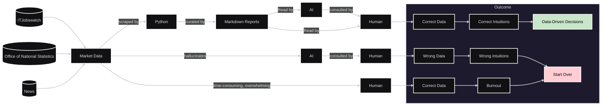

```
██████╗  ██████╗ ███████╗ █████╗ ██╗     ██╗ █████╗ 
██╔══██╗██╔═══██╗██╔════╝██╔══██╗██║     ██║██╔══██╗
██████╔╝██║   ██║███████╗███████║██║     ██║███████║
██╔══██╗██║   ██║╚════██║██╔══██║██║     ██║██╔══██║
██║  ██║╚██████╔╝███████║██║  ██║███████╗██║██║  ██║
╚═╝  ╚═╝ ╚═════╝ ╚══════╝╚═╝  ╚═╝╚══════╝╚═╝╚═╝  ╚═╝
```


# Rosalia -- Research Analyst for IT Markets 📊

[](https://www.python.org/downloads/)
[](LICENSE)
[](https://www.itjobswatch.co.uk/)
[](integration/)

A comprehensive UK IT market analysis tool that scrapes and analyzes data from ITJobsWatch to provide insights into technology trends, job market dynamics, and salary patterns across different tech sectors.

## Problem Statement:

**Volatility**<br>
Public opinions circulate both of the apparent collapse and growth of certain sectors in IT, such as Web Development and Artificial Intelligence -- with inconsistent sources of data. Without data-validated research, IT professionals are left looking over their shoulders in a volatile/ speculative market conditions.

**Manual Researching data is time consuming.** <br>
Sources such as ITJobsWatch tend to be viewed best individually. Grouping queries together does not always compare trends.

**Shortcomings of AI Deep Research** <br>
Cutting-edge Deep Research applications such as Gemini, Claude and ChatGPT, however impressive are still observed to hallucinate statistics. While their relevance continues to increase, hybrid solutions are likely optimal to verify particularly important data sources.

## Solution:


***Diagram (above):*** Using Python Scraping and Markdown Reports in research workflow ensures accurate data while saving burnout of manual research.

Rosalia scrapes data from reputable sources and collates them into markdown reports.

This can be viewed by a human or synchronised with an AI Project.

## 🎯 Overview

This project focuses on UK IT market analysis through comprehensive data collection from ITJobsWatch, providing insights into:

### ITJobsWatch Market Data

**Chart Analysis (Computer Vision)**
- Market share trends over 10-15 year periods
- Technology adoption patterns
- Growth and decline indicators
- Visual trend extraction from charts using OCR

**Job Listing Analysis**
- Current job availability by technology
- Salary ranges and compensation trends
- Geographic distribution (London-focused)
- Skills demand patterns

**Technologies Tracked:**
- **AI/ML**: Artificial Intelligence, Machine Learning, Data Science
- **Web Development**: JavaScript, TypeScript, React, Angular
- **Backend**: Python, C#, Java, ASP.NET
- **Cloud**: AWS, Google Cloud Platform, Azure
- **Data**: Data Analytics, Data Science, QA Testing

**Market Insights:**
- Currently limited to UK-specific data, with focus on London
- 10-15 year trend analysis
- Technology sector integration with UK economy
- Office of National Statistics correlation (planned)

## 📝 License

This project is licensed under the Apache License.

## 🙏 Acknowledgments

- ITJobsWatch.co.uk for providing comprehensive UK IT market data
- OpenCV community for computer vision tools
- UK Office of National Statistics for economic context
- Open source community for Python data analysis tools
