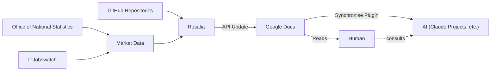

```
██████╗  ██████╗ ███████╗ █████╗ ██╗     ██╗ █████╗ 
██╔══██╗██╔═══██╗██╔════╝██╔══██╗██║     ██║██╔══██╗
██████╔╝██║   ██║███████╗███████║██║     ██║███████║
██╔══██╗██║   ██║╚════██║██╔══██║██║     ██║██╔══██║
██║  ██║╚██████╔╝███████║██║  ██║███████╗██║██║  ██║
╚═╝  ╚═╝ ╚═════╝ ╚══════╝╚═╝  ╚═╝╚══════╝╚═╝╚═╝  ╚═╝
```


# Rosalia -- Research Enterprise Codebases 📊

[](https://www.python.org/downloads/)
[](LICENSE)
[](https://docs.github.com/en/rest)
[](integration/)

A comprehensive analysis tool for examining GitHub repository statistics across different technology categories including AI/ML, TypeScript, C# ASP.NET, and developer tools.

## Problem Statement:

**Data-Driven Decision making**
Public opinions circulate both of the apparent collapse and growth of certain sectors in IT, such as Web Development and Artificial Intelligence -- with inconsistent sources of data. This can of course be ignored but skipping the need for data-driven research leaves freelancers, and IT professionals relying soley on intuition, constantly looking over their shoulder in a volatile/ speculative market conditions. 

**Manual Researching data is time consuming.** 
Sources such as ITJobsWatch tend to be viewed best individually. Grouping queries together does not always compare trends.

**AI Researching leaves room for error**
Cutting-edge Deep Research applications such as Gemini, Claud and ChatGPT, however impressive are observed to hallucinate statistics.

## Solution:



***Diagram (above):*** Using Rosalia in research workflow ensures accurate data while saving time of manual research.


Rosalia scrapes data from reputable sources and collates them into a Google Docs.

This can be viewed by a human or synchronised with an AI Project.

## 🎯 Overview

This project collects and analyzes 

### Data Collection

Statistics from 55+ popular open-source enterprise codebases, providing insights into:
- Star counts and popularity trends (formatted as 12.3k, 1.2M for readability)
- Fork and contributor statistics
- Pull request activity
- Technology stack distributions
- Repository health metrics

Statistics for emerging and collapsing markets in Technology Sector
- Currently limited to UK-specific, with focus on London
- ITJobswatch.co.uk
- 10-15 year trends
- Keywords: AI, ML, Web Development, Software Engineering, Data Science, Data Analytics, QA Testing
- Languages: Python, C#, Typescript, 
- Frameworks/ Technology: ASP.NET, Google Cloud, AWS, 

Statistics from Office of National Statistics
- understanding the Technology Sector and UK Economy on 10-15 year trend

## 🚀 Quick Start

### Prerequisites

- Python 3.8 or higher
- GitHub personal access token (for API access)

### Installation

1. Clone the repository:
```bash
git clone https://github.com/yourusername/research-enterprise-codebases.git
cd research-enterprise-codebases
```

2. Install dependencies:
```bash
pip install -r requirements.txt
```

3. Create a `.env` file with your GitHub token:
```bash
echo "GITHUB_TOKEN=your_github_token_here" > .env
```

### Usage

#### 1. Verify Setup
Test your configuration:
```bash
python scripts/quick_test.py
```

#### 2. Collect Data
Run the data collection script to fetch fresh statistics:
```bash
python api/github/collector.py
```

This will:
- Fetch repository data from GitHub API
- Handle rate limiting automatically
- Save results to `data/raw/github_repository_stats.csv`
- Create metadata file with collection timestamp

#### 3. Generate Reports
Create markdown reports with formatted data:
```bash
python scripts/generate_reports.py
```

#### 4. View Results
Open the generated markdown reports in `views/`:
- [Overview Report](views/all.md) - Comprehensive summary
- [AI/ML Repositories](views/ai_ml.md) - AI/ML focused analysis
- [TypeScript Projects](views/typescript.md) - TypeScript ecosystem
- [C# ASP.NET Projects](views/csharp.md) - C# ASP.NET analysis

## 📁 Project Structure

```
research-enterprise-codebases/
├── api/
│   ├── github/                          # GitHub API client modules
│   │   ├── client.py                    # API client with rate limiting
│   │   ├── collector.py                 # Data collection orchestrator
│   │   ├── models.py                    # Data structures
│   │   └── utils.py                     # Formatting utilities
│   └── config/
│       └── repositories.yml             # Repository configuration
├── data/
│   ├── raw/                            # Raw CSV data and metadata
│   └── processed/                       # Analysis results
├── views/                              # Generated markdown reports
│   ├── all.md                          # Comprehensive overview
│   ├── ai_ml.md                        # AI/ML repositories
│   ├── typescript.md                   # TypeScript projects
│   └── csharp.md                       # C# ASP.NET projects
├── scripts/
│   ├── generate_reports.py             # Report generation
│   └── quick_test.py                   # Setup verification
├── integration/
│   └── tests/                          # Integration tests
├── .github/workflows/                  # GitHub Actions automation
```

## 🔧 Configuration & Automation

### Repository Management
Add new repositories to analyze by editing `api/config/repositories.yml`:

```yaml
repositories:
  AI/ML:
    - tensorflow/tensorflow
    - pytorch/pytorch
  TypeScript:
    - microsoft/TypeScript
    - nestjs/nest
```

### GitHub Actions
Automated data collection runs weekly via GitHub Actions:
- Fetches fresh repository statistics
- Generates updated reports
- Commits changes automatically

### API Rate Limits
- With token: 5,000 requests/hour
- Without token: 60 requests/hour
- Automatic rate limit handling and retry logic

## 📊 Repository Categories

### AI/ML Repositories (20 repos)
- TensorFlow, PyTorch, scikit-learn
- Hugging Face ecosystem (Transformers, TRL)
- AutoGPT, ComfyUI, Ollama
- LangChain, Dify, n8n

### TypeScript Projects (21 repos)
- Backend frameworks: NestJS, Fastify, AdonisJS
- ORMs: TypeORM, Prisma, Drizzle
- Utilities: Zod, tRPC, Winston

### C# ASP.NET Projects (13 repos)
- ASP.NET Core, Entity Framework Core
- Microservices: Orleans, Polly, Ocelot
- E-commerce: nopCommerce

### Developer Tools
- Educational resources and development utilities

## 📈 Report Features

### Number Formatting
- Stars displayed as readable format: 12.3k, 1.2M, 147k
- Consistent formatting across all metrics

### Interactive Links
- Repository names link to GitHub (open in new tab)
- Easy navigation between category reports

### Statistics Summary
- Total repositories, stars, and forks per category
- Most popular and most active repositories
- Collection timestamps and metadata

## 🧪 Testing

Run integration tests to verify functionality:
```bash
cd integration
python -m pytest tests/ -v
```

Tests cover:
- API client initialization
- Number formatting utilities
- Configuration loading
- Directory structure validation

## 🤝 Contributing

1. Fork the repository
2. Add new repositories to `api/config/repositories.yml`
3. Run tests to ensure functionality
4. Submit a Pull Request

## 📝 License

This project is licensed under the MIT License.

## 🙏 Acknowledgments

- GitHub API for providing comprehensive repository data
- All the amazing open-source projects analyzed in this study
- Automated with ❤️ using GitHub Actions
