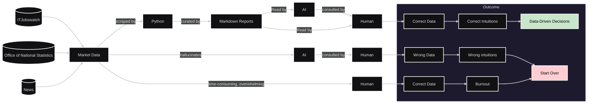

```
██████╗  ██████╗ ███████╗ █████╗ ██╗     ██╗ █████╗ 
██╔══██╗██╔═══██╗██╔════╝██╔══██╗██║     ██║██╔══██╗
██████╔╝██║   ██║███████╗███████║██║     ██║███████║
██╔══██╗██║   ██║╚════██║██╔══██║██║     ██║██╔══██║
██║  ██║╚██████╔╝███████║██║  ██║███████╗██║██║  ██║
╚═╝  ╚═╝ ╚═════╝ ╚══════╝╚═╝  ╚═╝╚══════╝╚═╝╚═╝  ╚═╝
```


# Rosalia -- Research Analyst for IT Markets 📊

[](https://www.python.org/downloads/)
[](LICENSE)
[](https://www.itjobswatch.co.uk/)
[](integration/)

A comprehensive UK IT market analysis tool that scrapes and analyzes data from ITJobsWatch to provide insights into technology trends, job market dynamics, and salary patterns across different tech sectors.

## Problem Statement:

**Volatility**<br>
Public opinions circulate both of the apparent collapse and growth of certain sectors in IT, such as Web Development and Artificial Intelligence -- with inconsistent sources of data. This can of course be ignored but skipping the need for data-driven research leaves freelancers and IT professionals relying soley on intuition, constantly looking over their shoulder in a volatile/ speculative market conditions.

**Manual Researching data is time consuming.** <br>
Sources such as ITJobsWatch tend to be viewed best individually. Grouping queries together does not always compare trends.

**Shortcomings of AI Deep Research** <br>
Cutting-edge Deep Research applications such as Gemini, Claude and ChatGPT, however impressive are still observed to hallucinate statistics. While their relevance continues to increase, hybrid solutions are likely optimal to verify particularly important data sources.

## Solution:


***Diagram (above):*** Using Python Scraping and Markdown Reports in research workflow ensures accurate data while saving burnout of manual research.

Rosalia scrapes data from reputable sources and collates them into markdown reports.

This can be viewed by a human or synchronised with an AI Project.

## 🎯 Overview

This project focuses on UK IT market analysis through comprehensive data collection from ITJobsWatch, providing insights into:

### ITJobsWatch Market Data

**Chart Analysis (Computer Vision)**
- Market share trends over 10-15 year periods
- Technology adoption patterns
- Growth and decline indicators
- Visual trend extraction from charts using OCR

**Job Listing Analysis**
- Current job availability by technology
- Salary ranges and compensation trends
- Geographic distribution (London-focused)
- Skills demand patterns

**Technologies Tracked:**
- **AI/ML**: Artificial Intelligence, Machine Learning, Data Science
- **Web Development**: JavaScript, TypeScript, React, Angular
- **Backend**: Python, C#, Java, ASP.NET
- **Cloud**: AWS, Google Cloud Platform, Azure
- **Data**: Data Analytics, Data Science, QA Testing

**Market Insights:**
- Currently limited to UK-specific data, with focus on London
- 10-15 year trend analysis
- Technology sector integration with UK economy
- Office of National Statistics correlation (planned)

## 🚀 Quick Start

### Prerequisites

- Python 3.8 or higher
- No API tokens required (ITJobsWatch public data)

### Installation

1. Clone the repository:
```bash
git clone https://github.com/yourusername/research-enterprise-codebases.git
cd research-enterprise-codebases
```

2. Install dependencies:
```bash
pip install -r requirements.txt
```

### Usage

#### 1. Scrape ITJobsWatch Charts
Extract data from trend charts:
```bash
python api/scraper/png-charts/it_jobs_watch/scripts/webp_scraper.py
```

#### 2. Process Chart Data
Analyze charts using computer vision:
```bash
python api/scraper/png-charts/it_jobs_watch/scripts/chart_parser.py
```

#### 3. Scrape Job Listings
Collect current job market data:
```bash
python api/scraper/table-data/itjobswatch_table_scraper.py
```

#### 4. Generate Market Reports
Create comprehensive analysis reports:
```bash
python api/scraper/png-charts/it_jobs_watch/scripts/generate_reports.py
```

#### 5. View Results
Open the generated markdown reports in `docs/`:
- [Market Overview](docs/all.md) - Comprehensive UK IT market summary
- [Job Trends Analysis](docs/job_trends.md) - Current job market insights
- [Technology Reports](docs/) - Individual technology analyses

## 📁 Project Structure

```
research-enterprise-codebases/
├── api/
│   └── scraper/
│       ├── png-charts/
│       │   └── it_jobs_watch/               # Chart analysis tools
│       │       ├── scripts/                 # Processing scripts
│       │       ├── annotating/              # Computer vision modules
│       │       └── outputs/                 # Processed chart data
│       └── table-data/                      # Job listing scrapers
│           ├── itjobswatch_table_scraper.py # Main scraper
│           └── models.py                    # Data structures
├── data/
│   ├── manual/                             # Reference data
│   └── scraped/
│       └── itjobswatch/                    # ITJobsWatch data
│           ├── file-data/                  # JSON chart data
│           ├── table-data/                 # CSV job listings
│           └── *.webp                      # Downloaded charts
├── docs/                                   # Generated reports
│   ├── all.md                             # Market overview
│   └── *.md                               # Technology-specific reports
├── integration/
│   └── tests/                             # Test suites
├── .github/workflows/                     # Automation
```

## 🔧 Configuration & Data Sources

### ITJobsWatch Integration
Rosalia extracts data from two primary sources:

**1. Trend Charts (WebP/PNG Analysis)**
- Historical market data visualization
- Computer vision extraction using OpenCV
- 10-15 year trend analysis
- Market share evolution tracking

**2. Job Listings (Table Scraping)**
- Current job market snapshot
- Salary ranges and requirements
- Geographic distribution
- Skills demand analysis

### Automated Processing
- Chart image processing with OCR
- Data validation and cleaning
- Trend analysis and reporting
- Markdown report generation

## 📊 Market Analysis Features

### Chart Processing Pipeline
1. **Image Acquisition**: Download charts from ITJobsWatch
2. **Computer Vision**: Extract data points using OpenCV and OCR
3. **Data Validation**: Cross-reference with manual data sources
4. **Trend Analysis**: Calculate growth rates and market shifts

### Job Market Insights
- **Technology Demand**: Track which technologies are growing/declining
- **Salary Trends**: Monitor compensation changes over time
- **Geographic Analysis**: London vs UK-wide comparison
- **Skills Correlation**: Identify complementary technology skills

### Report Generation
- **Interactive Analysis**: Technology-specific deep dives
- **Trend Visualization**: Market movement patterns
- **Data-Driven Insights**: Evidence-based market recommendations

## 🧪 Testing

Run integration tests to verify scraping functionality:
```bash
cd integration
python -m pytest tests/ -v
```

Tests cover:
- ITJobsWatch scraper functionality
- Chart processing algorithms
- Data integrity validation
- Report generation pipeline

## 📈 Current Data Coverage

### Technologies Analyzed
- **AI/ML**: Artificial Intelligence, Machine Learning, Data Science
- **Programming Languages**: Python, JavaScript, TypeScript, C#
- **Cloud Platforms**: AWS, Google Cloud, Azure
- **Frameworks**: ASP.NET, React, Angular
- **Data Tools**: Analytics, Business Intelligence

### Geographic Focus
- **Primary**: London job market
- **Secondary**: UK-wide trends
- **Future**: Regional analysis expansion

## 🤝 Contributing

1. Fork the repository
2. Add new technology keywords to scraper configuration
3. Improve chart processing algorithms
4. Enhance data validation methods
5. Submit a Pull Request

## 📝 License

This project is licensed under the MIT License.

## 🙏 Acknowledgments

- ITJobsWatch.co.uk for providing comprehensive UK IT market data
- OpenCV community for computer vision tools
- UK Office of National Statistics for economic context
- Open source community for Python data analysis tools
