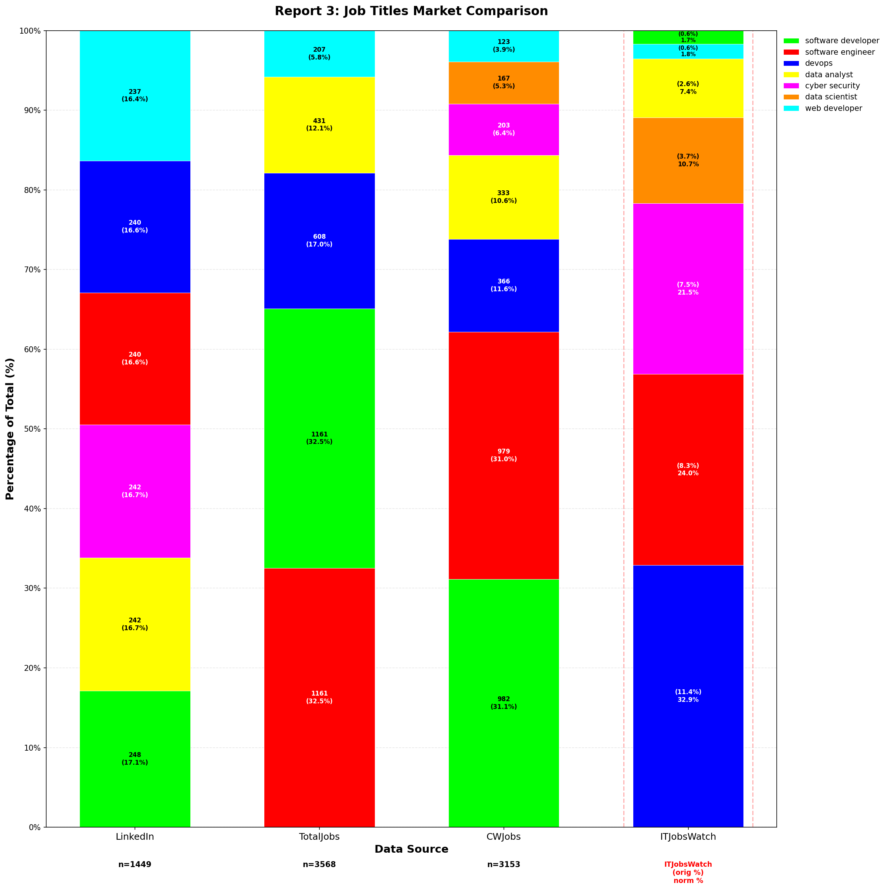
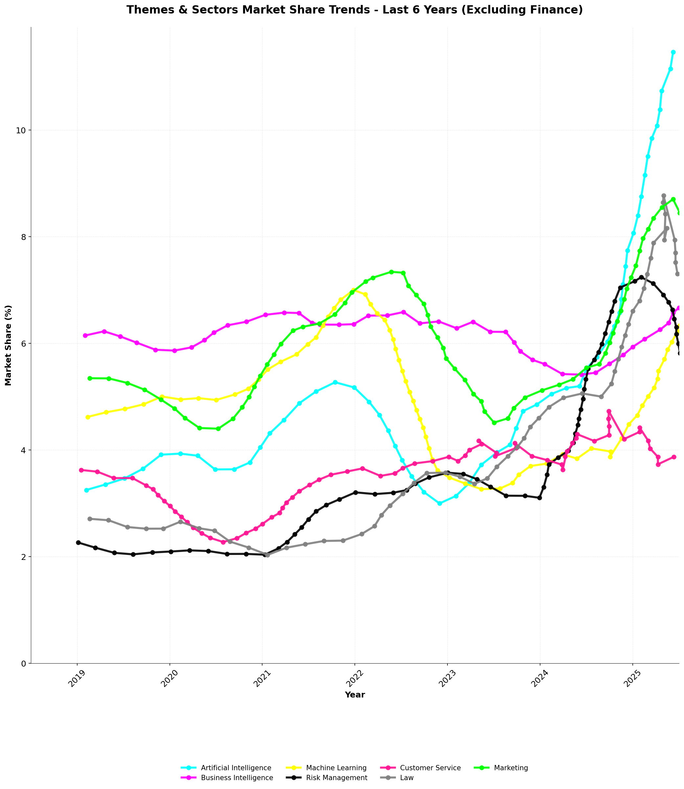

```
██████╗  ██████╗ ███████╗ █████╗ ██╗     ██╗ █████╗ 
██╔══██╗██╔═══██╗██╔════╝██╔══██╗██║     ██║██╔══██╗
██████╔╝██║   ██║███████╗███████║██║     ██║███████║
██╔══██╗██║   ██║╚════██║██╔══██║██║     ██║██╔══██║
██║  ██║╚██████╔╝███████║██║  ██║███████╗██║██║  ██║
╚═╝  ╚═╝ ╚═════╝ ╚══════╝╚═╝  ╚═╝╚══════╝╚═╝╚═╝  ╚═╝
```


# Rosalia -- Research Analyst for IT Markets 📊

[](https://www.python.org/downloads/)
[](LICENSE)
[](https://www.itjobswatch.co.uk/)
[](integration/)

A comprehensive UK IT market analysis tool that scrapes and analyzes data from ITJobsWatch to provide insights into technology trends, job market dynamics, and salary patterns across different tech sectors.

## Problem Statement:

**Volatility**<br>
Public opinions circulate both of the apparent collapse and growth of certain sectors in IT, such as Web Development and Artificial Intelligence -- with inconsistent sources of data. Without data-validated research, IT professionals are left looking over their shoulders in a volatile/ speculative market conditions.

**Manual Researching data is time consuming.** <br>
Sources such as ITJobsWatch tend to be viewed best individually. Grouping queries together does not always compare trends.

**Shortcomings of AI Deep Research** <br>
Cutting-edge Deep Research applications such as Gemini, Claude and ChatGPT, however impressive are still observed to hallucinate statistics. While their relevance continues to increase, hybrid solutions are likely optimal to verify particularly important data sources.

## Solution:


***Diagram (above):*** Using Python Scraping and Markdown Reports in research workflow ensures accurate data while saving burnout of manual research.

Rosalia scrapes data from reputable sources and collates them into markdown reports.

This can be viewed by a human or synchronised with an AI Project.

## 🎯 Overview

This project focuses on UK IT market analysis through comprehensive data collection from ITJobsWatch, providing insights into:

### Output

Written Analysis was made in private repository, but python extracted results are shown here -- free for anyone to use.


## 📊 Key Market Comparison Reports & Methodology

### Reports 1-3: Market Comparison Images

- 
- 
- 

### Methodology: Data Scraping & Chart Generation

**Data Sources:**
- Primary data is scraped from [ITJobsWatch.co.uk](https://www.itjobswatch.co.uk/) using custom Python scripts.
- Additional job board data is collected and aggregated from CSV files in `api/data/manual/jobtitle_jobsboard_count.csv` and related directories.

**Scraping & Processing Steps:**
1. **Job Board Data Extraction:**
   - The script `packages/csv-to-chart/generate_report_comparisons.py` parses job board CSVs and filters data by relevant categories (languages, cloud, job titles, themes, sectors).
   - Data is mapped and normalized to match ITJobsWatch categories for direct comparison.
2. **ITJobsWatch Benchmarks:**
   - Market share benchmarks for each category are extracted from ITJobsWatch and stored in code (see `itjobswatch_benchmarks.py`).
   - These are used as reference points in the comparison charts.
3. **Chart Generation:**
   - The script generates side-by-side bar charts for each report using `comparison_chart_generator.py`.
   - Output images are saved in `reports/jobs-boards/` as `report1_languages_comparison.png`, `report2_cloud_comparison.png`, etc.

**Individual Trend Charts:**
- For time-series trends (e.g., programming languages, cloud, themes/sectors), scripts like `generate_languages_chart.py`, `generate_cloud_technology_chart.py`, and `generate_themes_sectors_chart.py` load yearly CSVs from `api/data/manual/year_market-share/` and plot market share over time.

**Summary:**
- All data is programmatically scraped, parsed, and visualized using Python, ensuring reproducibility and transparency.
- The methodology enables direct comparison between job board demand and ITJobsWatch market share, highlighting both hiring activity and broader market trends.

## 📈 Longitudinal Market Trends

The following charts provide time-series insights into the evolution of the UK IT job market, based on ITJobsWatch data and curated CSVs. These trend charts complement the market comparison reports by showing how demand and market share have changed over time.

### Programming Languages Trends
- 
  - **Description:** Shows the market share of major programming languages (e.g., Python, JavaScript, Java, etc.) in the UK IT job market from 2004 to 2025.
  - **Source:** Data from `api/data/manual/year_market-share/languages/` (CSV files per language).
  - **Script:** `packages/csv-to-chart/generate_languages_chart.py`

### Cloud & Technology Infrastructure Trends
- 
  - **Description:** Tracks the rise and fall of cloud platforms (AWS, Azure, GCP) and related technologies over time.
  - **Source:** Data from `api/data/manual/year_market-share/cloud/` (CSV files per cloud provider).
  - **Script:** `packages/csv-to-chart/generate_cloud_technology_chart.py`

### Job Titles Trends
- 
  - **Description:** Visualizes the changing demand for key IT job titles (e.g., Software Engineer, Data Scientist, DevOps, etc.) across years.
  - **Source:** Data from `api/data/manual/year_market-share/job-title/` (CSV files per job title).
  - **Script:** `packages/csv-to-chart/generate_job_titles_chart.py`

### Themes & Sectors Trends
- 
  - **Description:** Shows the market share trends for major IT themes (AI, BI, CRM, etc.) and sectors (Finance, Marketing, etc.).
  - **Source:** Data from `api/data/manual/year_market-share/themes/` and `api/data/manual/year_market-share/sectors/`.
  - **Script:** `packages/csv-to-chart/generate_themes_sectors_chart.py`

- 
  - **Description:** Focuses on the last 6 years for a more detailed view of recent trends in themes and sectors.

- 
  - **Description:** Shows the same trends as above, but with the finance sector excluded to highlight other industries.
  - **Script:** `packages/csv-to-chart/generate_themes_sectors_excl_finance_chart.py`

**How to Use:**
- These charts help identify long-term shifts, emerging technologies, and the impact of macroeconomic events on the UK IT job market.
- All trend data is programmatically extracted and visualized for transparency and reproducibility.

## 📝 License

This project is licensed under the Apache License.

## 🙏 Acknowledgments

- ITJobsWatch.co.uk for providing comprehensive UK IT market data
- OpenCV community for computer vision tools
- UK Office of National Statistics for economic context
- Open source community for Python data analysis tools
