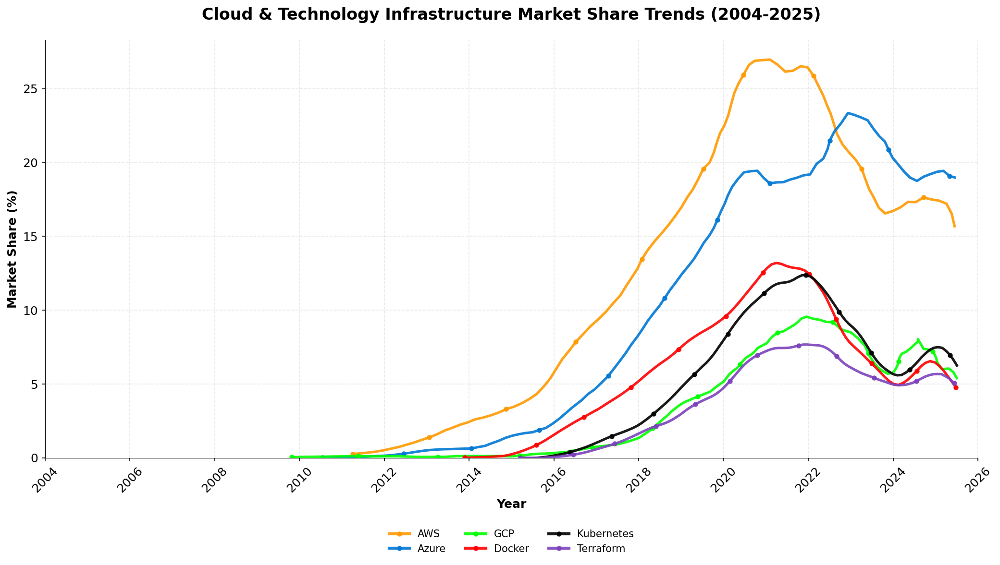
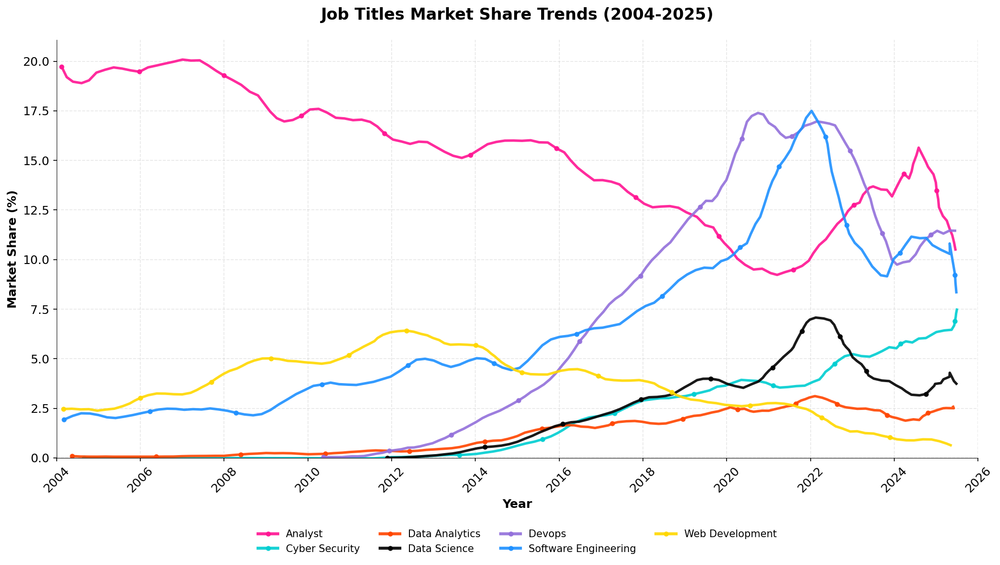
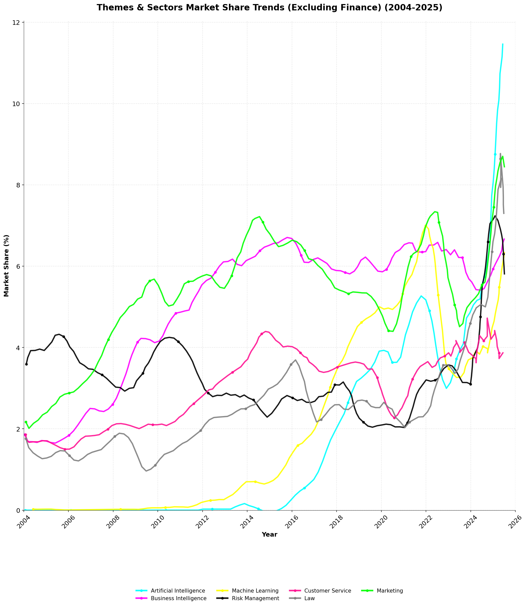

# London Permanent Jobs Market Report 2025

## Introduction

The London permanent job market continues to evolve rapidly, driven by technological transformation and shifting business priorities. This report analyzes market share trends across six key dimensions - technology roles, programming languages, cloud infrastructure, job titles, and industry sectors - providing data-driven insights from 2004 to 2025. The data reveals a clear narrative: artificial intelligence and cloud technologies are reshaping the employment landscape, while traditional roles adapt to meet modern demands.

## Report 1: Technology Market Trends

**Top 3 Technologies by Market Share (2025):**
1. Artificial Intelligence - 11.46%
2. DevOps - 11.45%
3. Software Engineering - 8.35%

The technology landscape has undergone a seismic shift with artificial intelligence and DevOps practices achieving near-equal dominance at approximately 11.5% market share each. This dual leadership reflects the industry's parallel priorities: innovation through AI capabilities and operational excellence through DevOps methodologies. The sustained growth of AI from virtually zero presence in 2008 to market leadership demonstrates the technology's transition from experimental to essential. Meanwhile, DevOps' rise from 0.66% in 2012 to current levels illustrates how continuous integration and deployment have become fundamental to modern software delivery. Software Engineering maintains a robust 8.35% share, serving as the foundational discipline that enables both AI implementation and DevOps practices.

## Report 2: Programming Languages Trends

**Top 3 Programming Languages by Market Share (2025):**
1. Python - 18.52%
2. Java - 8.02%
3. JavaScript - 7.21%

Python's commanding 18.52% market share represents a remarkable transformation from its modest beginnings, driven primarily by its dominance in data science, machine learning, and AI development. The language's simple syntax and extensive library ecosystem have made it the de facto choice for organizations building AI capabilities. Java maintains resilience at 8.02%, supported by enterprise systems and Android development, though its share has declined from historical peaks above 20%. JavaScript at 7.21% remains essential for web development, while TypeScript's emergence at 5.79% signals the industry's growing emphasis on type safety and maintainable code. The language landscape clearly favors versatility and AI-readiness over traditional enterprise-only platforms.

## Report 3: Cloud & Technology Infrastructure Trends

**Top 3 Cloud & Infrastructure Technologies by Market Share (2025):**
1. Azure - 18.99%
2. AWS - 15.69%
3. Kubernetes - 6.25%

Microsoft Azure's leadership position at 18.99% market share reflects enterprise organizations' preference for integrated cloud solutions that seamlessly connect with existing Microsoft ecosystems. AWS maintains strong second position at 15.69%, benefiting from its first-mover advantage and comprehensive service portfolio. The real story lies in container orchestration, where Kubernetes at 6.25% has become the standard for cloud-native applications, while complementary technologies like Terraform (5.08%) and Docker (4.79%) enable infrastructure-as-code and containerization strategies. This infrastructure stack demonstrates how modern organizations prioritize scalability, portability, and automation in their technology choices.

## Report 4: Job Titles Market Trends

**Top 3 Job Titles by Market Share (2025):**
1. Analyst - 10.51%
2. Software Engineering - 8.35%
3. Cyber Security - 7.47%

The prominence of Analyst roles at 10.51% market share highlights the critical importance of data-driven decision making in modern businesses. Organizations increasingly require professionals who can interpret complex datasets, identify patterns, and translate insights into strategic advantages. Software Engineering positions at 8.35% remain fundamental to digital transformation initiatives, while the surge in Cyber Security roles to 7.47% reflects heightened awareness of digital threats and regulatory compliance requirements. The rise of DevOps positions from near-zero to significant market presence demonstrates how operational roles have evolved to bridge development and infrastructure domains. This distribution suggests organizations are building balanced teams combining analytical capability, engineering expertise, and security consciousness.

## Report 5: Themes & Sectors Market Trends

**Top 3 Themes & Sectors by Market Share (2025):**
1. Finance - 33.53%
2. Artificial Intelligence - 11.46%
3. Marketing - 8.45%

London's position as a global financial center is unmistakably reflected in Finance sector's dominant 33.53% share of permanent IT positions. This concentration demonstrates how financial services drive technology employment, requiring sophisticated systems for trading, risk management, and regulatory compliance. The emergence of AI as a cross-sector theme at 11.46% indicates its pervasive adoption beyond traditional tech companies into finance, healthcare, and retail. Marketing's 8.45% share reveals the digital transformation of customer engagement, with organizations investing heavily in data-driven marketing platforms, personalization engines, and customer analytics. This sector distribution confirms London's dual identity as both a financial powerhouse and an emerging AI innovation hub.

## Report 6: Themes & Sectors Market Trends (Excluding Finance)

**Top 3 Themes & Sectors by Market Share (2025, Excluding Finance):**
1. Artificial Intelligence - 11.46%
2. Marketing - 8.45%
3. Risk Management - 7.30%

Removing Finance's dominant presence reveals the true diversity of London's technology employment landscape. AI's leadership at 11.46% confirms its status as the defining technology trend across all sectors, from healthcare diagnostics to retail recommendations. Marketing technology at 8.45% reflects the sophisticated digital customer engagement strategies required in competitive markets. Risk Management's significant 7.30% share, even outside pure financial services, demonstrates how regulatory compliance and risk assessment have become universal business concerns across industries. The rapid growth of these sectors from minimal presence to current levels illustrates London's evolution from finance-centric to a more diversified technology economy embracing innovation across multiple domains.